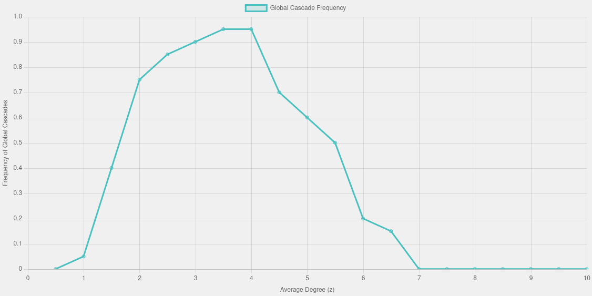

# Global Cascades Simulation

This repository hosts the code for a "Global Cascades Simulation" based on Watts' influential paper, "A simple model of global cascades". The simulation visualizes the frequency of cascades across different network densities and provides insights into how small initial shocks can lead to widespread effects in a network.

## Interactive Simulation
Experience the simulation in action [here](http://galenwilkerson.github.io/global_cascade.html). Adjust various parameters and observe how the cascade frequency changes in real-time.

## Background
The simulation is built upon the model introduced by Duncan Watts which explores the conditions under which small initial shocks can propagate through a network to cause large-scale cascades. The model is particularly focused on the concept of network percolation as the average degree (z) of nodes increases, highlighting how a critical point can be reached beyond which a small initial disturbance can result in a global cascade.

## Key Features
- **Visualization of Cascade Dynamics**: The simulation plots the frequency of global cascades as a function of the network's average degree (z). As z increases, the simulation illustrates an increase in cascade frequency, reflecting network percolation.
- **Analysis of Blocking Effects**: At higher values of z, the simulation demonstrates a blocking effect where increased network density can actually inhibit the spread of cascades, contrary to what one might expect. This is a critical insight for understanding the stability and resilience of complex networks.

## Technical Details
The repository includes HTML and JavaScript files necessary to run the simulation on a web server. The core algorithm simulates cascades on random graphs with varying average degrees, analyzing how often these cascades become global based on the threshold parameter φ.

## Usage
To run the simulation locally:
1. Clone the repository.
2. Open `global_cascade.html` in a web browser to view and interact with the simulation.

## Contributing
Contributions to improve the simulation or enhance its features are welcome. Please feel free to fork the repository, make changes, and submit a pull request.

## Citation
If you use this simulation for academic or research purposes, please cite Watts' original paper:
Watts, D. J. (2002). A simple model of global cascades on random networks. *Proceedings of the National Academy of Sciences*, 99(9), 5766-5771.

## License
This project is licensed under the MIT License - see the [LICENSE](LICENSE.md) file for details.
